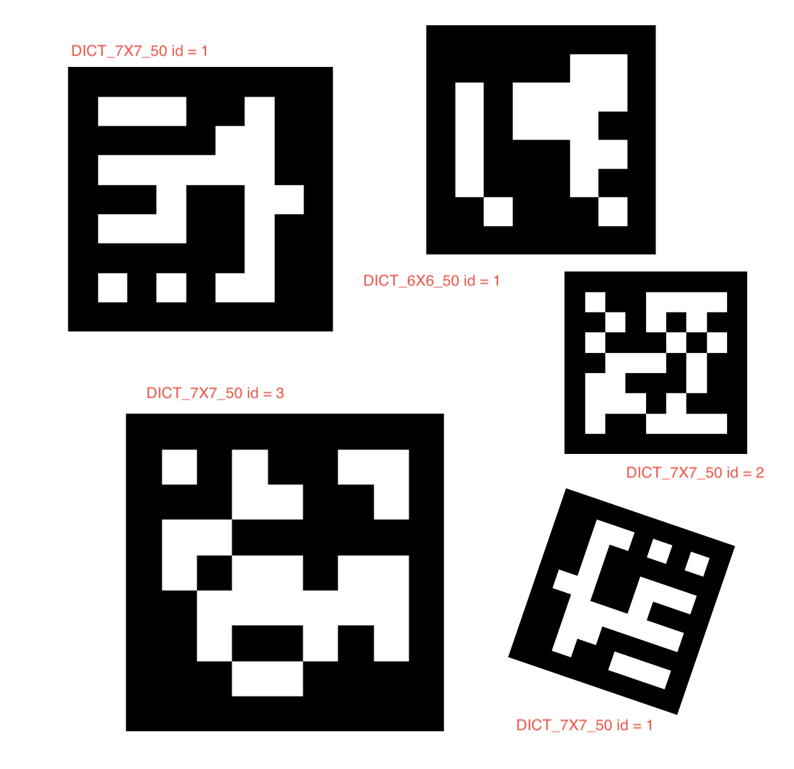
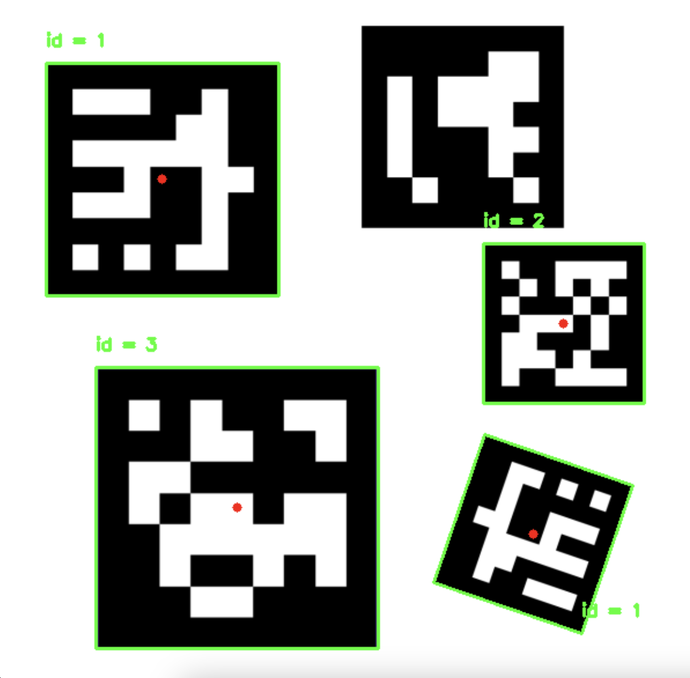

# ProjetTransversal
Cette branche vise à permettre la détection des marqueurs ArUco.

## Présentation des marqueurs
Les marqueurs ArUco sont des marqueurs fiduciaires utilisés dans les systèmes de vision par ordinateur pour localiser, suivre et estimer la pose d'objets dans un environnement. Ils font partie de la même famille que les QR Codes, mais sont constitués de seulement une vingtaine de pixels (de 4X4 à 7X7). Leur configuration simple limite la quantité d'information qu'ils peuvent contenir, mais cela facilite leur détection. Il existe plusieurs dictionnaires afin de définir les marqueurs. OpenCV ne détectera que les ArUco présents dans la scène appartenant au dictionnaire spécifié.

## Librairies
Ce programme nécessite une version ultérieure à OpenCV4.7 ainsi que Numpy pour fonctionner correctement.

## Utilisation
Il suffit de compiler le code souhaité à l'aide d'un interprétateur Python.

## Utilisation de generate_aruco.py

Pour générer des marqueurs ArUco à l'aide du script `generate_aruco.py`, suivez ces étapes :

1. Ouvrez votre terminal ou votre invite de commande.

2. Naviguez vers le répertoire `ProjetTransversal` en utilisant la commande `cd`. Par exemple :

    ```
    cd /chemin/vers/votre/répertoire
    ```

3. Exécutez le script en utilisant Python 3 en tapant la commande suivante :

    ```
    python3 ./src/generate_aruco.py -i [id_du_marqueur_aruco] -t [type_de_dictionnaire]
    ```

    Remplacez `[id_du_marqueur_aruco]` par l'ID souhaité pour le marqueur ArUco et `[type_de_dictionnaire]` par le type de dictionnaire ArUco à utiliser.

4. Après avoir exécuté le script, l'image du marqueur ArUco générée sera enregistrée dans le répertoire `./tags/` avec un nom de fichier suivant le format : `type_id.png`.

    Par exemple, si vous souhaitez générer un marqueur ArUco avec l'ID 42 en utilisant le dictionnaire DICT_6X6_250, vous exécuteriez la commande suivante :

    ```
    python3 ./src/generate_aruco.py -i 42 -t DICT_6X6_250
    ```

L'image générée sera enregistrée sous le nom `DICT_6X6_250_42.png` dans le répertoire `./tags/`.


## Partie détection des ArUco
### Utilisation de detect_aruco_image.py

Pour générer des marqueurs ArUco à l'aide du script `detect_aruco_image.py`, suivez ces étapes :

1. Ouvrez votre terminal ou votre invite de commande.

2. Naviguez vers le répertoire `ProjetTransversal` en utilisant la commande `cd`. Par exemple :

    ```
    cd /chemin/vers/votre/répertoire
    ```

3. Exécutez le script en utilisant Python 3 en tapant la commande suivante :

    ```
    python3 ./src/detect_aruco_image.py -i [image] -t [type_de_dictionnaire]
    ```

    Remplacez `[image]` par l'image dont vous souhaitez détecter les marqueurs et `[type_de_dictionnaire]` par le type de dictionnaire ArUco à utiliser.

4. Après avoir exécuté le script, l'image passé en paramètre sera modifiée afin de posséder des contours autour des marqueurs détectés, ainsi que l'id de celui-ci.

    Par exemple, si vous souhaitez détecter des marqueurs ArUco présent dans une scène utilisant le dictionnaire DICT_7X7_50, vous exécuteriez la commande suivante :

    ```
    python3 ./src/detect_aruco_image.py -i ./tags/exemple.png -t DICT_7X7_50
    ```

Nous utilisons la scène suivante :



L'image s'affichera alors, contenant une surlignance verte de la bordure de nos marqueurs, le centre des marqueurs en rouge, ainsi que les identifiants des ArUco. Voici à quoi cela ressemble :



### Détection dans une vidéo